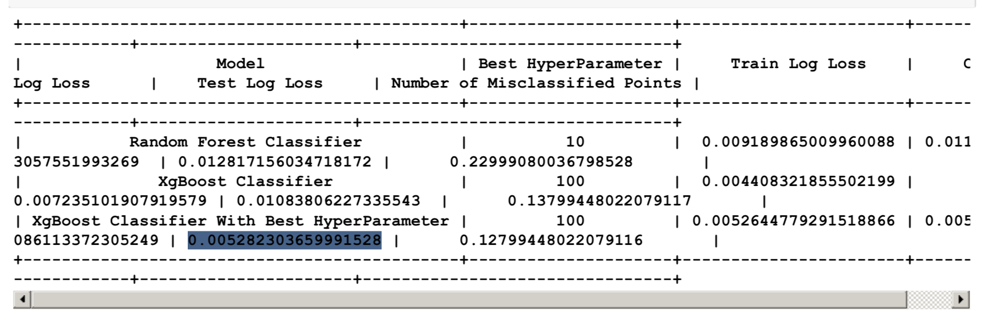

<h1>A Brief Introduction to The Microsoft Malware Detection Case Study</h1>

<h2>1. Business/Real-world Problem</h2>

<h3>1.1 What is Malware?</h3>

- The term malware is a contraction of malicious software. Put simply, malware is any piece of software that was written with the intent of doing harm to data, devices or to people.
Source: https://www.avg.com/en/signal/what-is-malware

<h3>1.2 Problem Statement</h3>

- In the past few years, the malware industry has grown very rapidly that, the syndicates invest heavily in technologies to evade traditional protection, forcing the anti-malware groups/communities to build more robust softwares to detect and terminate these attacks. The major part of protecting a computer system from a malware attack is to <b>identify whether a given piece of file/software is a malware.</b>

<h3>1.3 Dataset Overview</h3>

- Microsoft has been very active in building anti-malware products over the years and it runs it’s anti-malware utilities over 150 million computers around the world. This generates tens of millions of daily data points to be analyzed as potential malware. In order to be effective in analyzing and classifying such large amounts of data, we need to be able to group them into groups and identify their respective families.
This dataset provided by Microsoft contains about 9 classes of malware. , Source: https://www.kaggle.com/c/malware-classification

<h3>1.4 Real-world/Business objectives and constraints.</h3>

1. Minimize multi-class error.
2. Multi-class probability estimates.
3. Malware detection should not take hours and block the user's computer. It should fininsh in a few seconds or a minute.

<h2>2. Data Overview</h2>

- Source : https://www.kaggle.com/c/malware-classification/data
- For every malware, we have two files
    1. .asm file (read more: https://www.reviversoft.com/file-extensions/asm)
    2. .bytes file (the raw data contains the hexadecimal representation of the file's binary content, without the PE header)
- Total train dataset consist of 200GB data out of which 50Gb of data is .bytes files and 150GB of data is .asm files: Lots of Data for a single-box/computer.
- There are total 10,868 .bytes files and 10,868 asm files total 21,736 files
- There are 9 types of malwares (9 classes) in our given data
- Types of Malware:
    1. Ramnit
    2. Lollipop
    3. Kelihos_ver3
    4. Vundo
    5. Simda
    6. Tracur
    7. Kelihos_ver1
    8. Obfuscator.ACY
    9. Gatak
- For each file, the raw data contains the hexadecimal representation of the file's binary content, without the PE header (to ensure sterility).  You are also provided a metadata manifest, which is a log containing various metadata information extracted from the binary, such as function calls, strings, etc. This was generated using the IDA disassembler tool. Your task is to develop the best mechanism for classifying files in the test set into their respective family affiliations.

<h2>3. High Level Steps to Run Case Study</h2>

    1. Data overview
    2. Mapping the real world problem to ml problem
    3. Data Preprocessing and Exploratory Data Analysis(EDA)
    4. Train,Test and CV split
    5. Modeling
    6. Prediction

<h2>4. Major Challenges</h2>

    1. Disk Space (This case study requires approx. 250 GB free space on your disk)
    2. Time (Approx. 48 hours to fetch Features from asm files (150 GB)), Please use data/asmoutputfile.csv file insteadof processing whole asm files.
    3. Feature Engineering (Image Based Features Extraction from asm files)

<h2>5. ML Models</h2>

<h3>5.1 ML Models on .byte files unigram</h3>

    1. Random Model 
    2. K Nearest Neighbour Classification 
    3. Logistic Regression 
    4. Random Forest Classifier
    5. XgBoost Classification 
    6. XgBoost Classification with best hyper parameters using RandomSearch 
<h3>5.2 ML Models on .asm files unigram</h3>

    1. K Nearest Neighbour Classification 
    2. Logistic Regression 
    3. Random Forest Classifier
    4. XgBoost Classification 
    5. XgBoost Classification with best hyper parameters using RandomSearch 
<h3>5.3 Select Best ML Models</h3>

    1. Random Forest Classifier
    2. XgBoost Classification 
<h3>5.4 ML Models on .byte + .asm files unigrams<h3>

    1. Random Forest Classifier
    2. XgBoost Classification 
    3. XgBoost Classification with best hyper parameters using RandomSearch
<h3>5.5 ML Models on .byte files bigram</h3>

    1. Random Forest Classifier
    2. XgBoost Classification 
    3. XgBoost Classification with best hyper parameters using RandomSearch
<h3>5.6 ML Models on Image Based Features Extraction from asm files</h3>

    1. Random Forest Classifier
    2. XgBoost Classification 
    3. XgBoost Classification with best hyper parameters using RandomSearch
<h3>5.7 I tried following combination of features with best models (Random Forest and XgBoost)</h3>

    1. ASM image features + bytes uni-gram features
    2. ASM unigram + ASM extracted image features
    3. ASM unigram + ASM image features + ByteFile unigram

<h2>6. Result</h2>

- <b>ASM unigram + ASM image features + ByteFile unigram (XgBoost Classifier With Best HyperParameter) reduced the log-loss < 0.01 (0.005282303659991528)</b>

    
